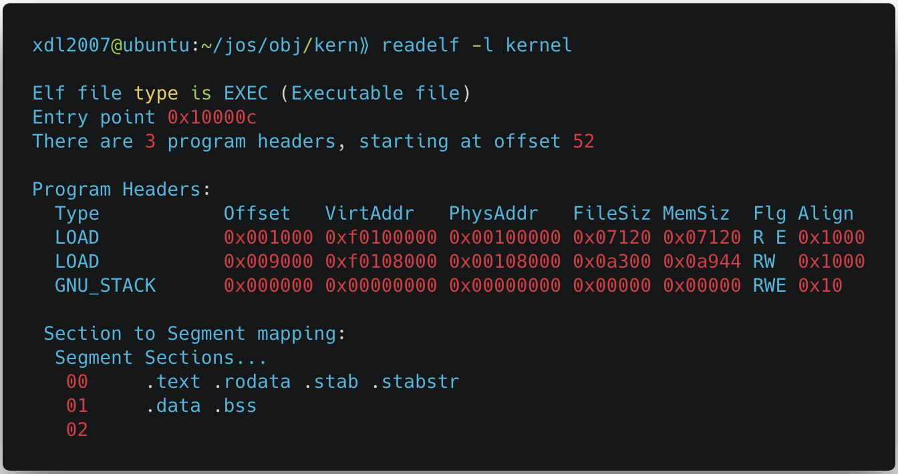

**Operating Systems Engineering: 6.828 teaches the fundamentals of engineering operating systems.** 

> https://pdos.csail.mit.edu/6.828/2017/overview.html
>
> The major parts of the JOS operating system are:
>
> 1. Booting
> 2. Memory management
> 3. User environments
> 4. Preemptive multitasking
> 5. File system, spawn, and shell
> 6. Network driver

---

#### Part1: PC Bootstrap

**Exercise 1.** Familiarize yourself with the assembly language materials available on [the 6.828 reference page](https://pdos.csail.mit.edu/6.828/2017/reference.html). You don't have to read them now, but you'll almost certainly want to refer to some of this material when reading and writing x86 assembly. 

We do recommend reading the section "The Syntax" in [Brennan's Guide to Inline Assembly](http://www.delorie.com/djgpp/doc/brennan/brennan_att_inline_djgpp.html). It gives a good (and quite brief) description of the AT&T assembly syntax we'll be using with the GNU assembler in JOS.

> 关于Inline Assembly，参考这个链接：http://www.ibiblio.org/gferg/ldp/GCC-Inline-Assembly-HOWTO.html

---

**Exercise 2.** Use GDB's `si` (Step Instruction) command to trace into the ROM BIOS for a few more instructions, and try to guess what it might be doing. You might want to look at [Phil Storrs I/O Ports Description](http://web.archive.org/web/20040404164813/members.iweb.net.au/~pstorr/pcbook/book2/book2.htm), as well as other materials on the [6.828 reference materials page](https://pdos.csail.mit.edu/6.828/2017/reference.html). No need to figure out all the details - just the general idea of what the BIOS is doing first.

> When the BIOS runs, it sets up an interrupt descriptor table and initializes various devices such as the VGA display.
>
> After initializing the PCI bus and all the important devices the BIOS knows about, it searches for a bootable device such as a floppy, hard drive, or CD-ROM. Eventually, when it finds a bootable disk, the BIOS reads the *boot loader* from the disk and transfers control to it.

---

#### Part 2: The Boot Loader 

**Exercise 3.** Take a look at the [lab tools guide](https://pdos.csail.mit.edu/6.828/2017/labguide.html), especially the section on GDB commands. Even if you're familiar with GDB, this includes some esoteric GDB commands that are useful for OS work. 

Set a breakpoint at address 0x7c00, which is where the boot sector will be loaded. Continue execution until that breakpoint. Trace through the code in `boot/boot.S`, using the source code and the disassembly file `obj/boot/boot.asm` to keep track of where you are. Also use the `x/i` command in GDB to disassemble sequences of instructions in the boot loader, and compare the original boot loader source code with both the disassembly in `obj/boot/boot.asm` and GDB. 

Trace into `bootmain()` in `boot/main.c`, and then into `readsect()`. Identify the exact assembly instructions that correspond to each of the statements in `readsect()`. Trace through the rest of `readsect()` and back out into `bootmain()`, and identify the begin and end of the `for` loop that reads the remaining sectors of the kernel from the disk. Find out what code will run when the loop is finished, set a breakpoint there, and continue to that breakpoint. Then step through the remainder of the boot loader. Be able to answer the following questions:

- At what point does the processor start executing 32-bit code? What exactly causes the switch from 16- to 32-bit mode?

  - boot.S中的ljmp之后，开始执行第一条32-bit指令，也就是说ljmp是最后一条16-bit指令。**这个长跳转导致了处理器模式的切换**：在修改了PE位之后，程序必须立即使用一条跳转指令，以刷新处理器流水线中已经获取的不同模式下的任何指令。ljmp之前的指令，包括ljmp都是在16-bit模式下被处理器执行的。当执行ljmp跳转指令时，**处理器流水线被清空，CS段寄存器被设置为0x8**（段选择子0x8）。之前已经初始化好GDTR，PE的使能进入了保护模式并开启段级保护，下一条指令的取指会使用段地址转换机制。
  - 先前设置的代码段和数据段的基址、限长均为[0x00000000,0xFFFFFFFF)，所以经过段地址转换后得到的**线性地址和虚拟地址（逻辑地址）一致**，由于还没有开启分页机制，此线性地址即为处理器地址总线产生的物理地址。

- What is the *last* instruction of the boot loader executed, and what is the *first* instruction of the kernel it just loaded?

  - bootloader执行的最后一条指令是`call *0x10018`，也就是`(void (*)(void))(ELFHDR->e_entry())`，内存地址`0x10018`的内容是`0x10000C`。
  - 内核的第一条指令是：`movw $0x1234, 0x472`

- *`Where`* is the first instruction of the kernel?

  - 内核执行的第一条指令位于`0x10000C`处（物理地址）

- How does the boot loader decide how many sectors it must read in order to fetch the entire kernel from disk? Where does it find this information?

  - bootloader先读了包含ELF header的一页（4K，足够大包含完整的ELF header）到内存，根据ELF header得到program headers的偏移和个数，进而得到每个program segment在文件中的偏移、Memsize、需要加载到的物理地址（由链接脚本控制），一个接一个的加载到指定的内存地址中。

  - 内核的链接由`kernel.ld`脚本控制，生成的ELF中包含的segment个数为3，其中GUN_STACK其MemSize为0，没有东西需要加载到内存：

    

---

**Exercise 6.** We can examine memory using GDB's x command. The [GDB manual](https://sourceware.org/gdb/current/onlinedocs/gdb/Memory.html) has full details, but for now, it is enough to know that the command x/*N*x *ADDR* prints *N* words of memory at *ADDR*. (Note that both '`x`'s in the command are lowercase.) *Warning*: The size of a word is not a universal standard. In GNU assembly, a word is two bytes (the 'w' in xorw, which stands for word, means 2 bytes).

Reset the machine (exit QEMU/GDB and start them again). Examine the 8 words of memory at 0x00100000 at the point the BIOS enters the boot loader, and then again at the point the boot loader enters the kernel. Why are they different? What is there at the second breakpoint? (You do not really need to use QEMU to answer this question. Just think.)

- bootloader开始执行时，0x100000地址处全为0，没有任何数据；之后bootloader将内核加载到这个地址，所以在第二个断点处通过gdb的反汇编可以看到内核的指令：

  

---

#### Part 3: The Kernel

**Exercise 7.** Use QEMU and GDB to trace into the JOS kernel and stop at the `movl %eax, %cr0`. Examine memory at 0x00100000 and at 0xf0100000. Now, single step over that instruction using the stepi GDB command. Again, examine memory at 0x00100000 and at 0xf0100000. Make sure you understand what just happened.

What is the first instruction *after* the new mapping is established that would fail to work properly if the mapping weren't in place? Comment out the `movl %eax, %cr0` in `kern/entry.S`, trace into it, and see if you were right.

- 第一条失败的指令是`jmp *%eax`：跳转指令引起处理器从新的地址取指令（访问存储器），由于注释掉了开启分页的代码，指令地址无法正确转换到物理地址，引起qemu崩溃. 

  > Any virtual address that is not in one of these two ranges will cause a hardware exception which, since we haven't set up interrupt handling yet, will cause QEMU to dump the machine state and exit.

  

---

**Exercise 8.** We have omitted a small fragment of code - the code necessary to print octal numbers using patterns of the form "%o". Find and fill in this code fragment. 

1. Explain the interface between `printf.c` and `console.c`. Specifically, what function does `console.c` export? How is this function used by `printf.c`?

   - `int cputch(int c)`
   - `printf.c`使用这个函数将字符输出到串口。

2. Explain the following from `console.c`:

   ```c
   if (crt_pos >= CRT_SIZE) {
   	int i;
       memmove(crt_buf, crt_buf + CRT_COLS, (CRT_SIZE - CRT_COLS) * sizeof(uint16_t));
       for (i = CRT_SIZE - CRT_COLS; i < CRT_SIZE; i++)
       	crt_buf[i] = 0x0700 | ' ';
       crt_pos -= CRT_COLS;
   }

   // 是scroll功能的实现，将当前屏幕除第一行的内容上移一行，最后一行清空，更新当前显式位置
   ```

3. For the following questions you might wish to consult the notes for Lecture 2. These notes cover GCC's calling convention on the x86. Trace the execution of the following code step-by-step:

   ```c
   int x = 1, y = 3, z = 4;
   cprintf("x %d, y %x, z %d\n", x, y, z);
   ```

   - In the call to `cprintf()`, to what does `fmt` point? To what does `ap` point?
     - `fmt`指向格式化字符串，`ap`指向第一个参数（也就是`x`）（`ap`实际上是一个`char *`，[参考这里](https://stackoverflow.com/questions/12371450/how-are-variable-arguments-implemented-in-gcc)和[这里](http://blog.aaronballman.com/2012/06/how-variable-argument-lists-work-in-c/)）


   - List (in order of execution) each call to `cons_putc`, `va_arg`, and `vcprintf`. For `cons_putc`, list its argument as well. For `va_arg`, list what `ap` points to before and after the call. For `vcprintf` list the values of its two arguments.
     - `vcprintf`参数`"x %d, y %x, z %d\n"`和`va_list`
     - `cons_putc('x'); cons_putc(' ')`
     - `ap->x; va_arg(); ap->y;`
     - `cons_puts(1); cons_puts(,); cons_puts(' '); cons_puts('y'); cons_puts(' ')`
     - `ap->y; va_arg(); ap->z;`
     - `cons_puts(3); cons_puts(,); cons_puts(' '); cons_puts('z'); cons_puts(' ')`
     - `ap->z; va_arg(); ap->null(after va_end();`
     - `cons_puts(4); cons_puts('\n')`

4. Run the following code.

   ```c
   unsigned int i = 0x00646c72;
   cprintf("H%x Wo%s", 57616, &i);
   ```

   What is the output? Explain how this output is arrived at in the step-by-step manner of the previous exercise. [Here's an ASCII table](http://web.cs.mun.ca/~michael/c/ascii-table.html) that maps bytes to characters.

   - `He110 World`
   	 57616 的16进制表示是`0xe110`。 `%s`打印`i`的内容，在little-endian机器上依次打印0x72、 0x6c、 0x64、 0x00，其ASCII表示分别为`'r','l','d','\0'`。	

   The output depends on that fact that the x86 is little-endian. If the x86 were instead big-endian what would you set `i` to in order to yield the same output? Would you need to change`57616` to a different value? [Here's a description of little- and big-endian](http://www.webopedia.com/TERM/b/big_endian.html) and [a more whimsical description](http://www.networksorcery.com/enp/ien/ien137.txt).

   - 如果x86是big-endian，57616不需要修改；`i`的值则需要修改为`0x726c6400`。

5. In the following code, what is going to be printed after `'y='`? (note: the answer is not a specific value.) Why does this happen?

   ```c
   cprintf("x=%d y=%d", 3);
   ```

   - 首先假设函数的参数以及可变参数的实现是通过栈实现的，并且函数实参按相反的顺序入栈。由于实际参数的个数偏少，`va_arg`会取栈上`3`后面4字节（假设int为4字节大小）为实参，按照十进制输出。

6. Let's say that GCC changed its calling convention so that it pushed arguments on the stack in declaration order, so that the last argument is pushed last. How would you have to change `cprintf` or its interface so that it would still be possible to pass it a variable number of arguments?

   - 接口改为`cprintf(..., const char* fmt)`，总之保证`fmt`是最后一个入栈的参数

---

**Exercise 9.** Determine where the kernel initializes its stack, and exactly where in memory its stack is located. How does the kernel reserve space for its stack? And at which "end" of this reserved area is the stack pointer initialized to point to?

- 内核栈的初始化在`entry.S`文件中：`movl $(bootstacktop) %esp`
- `bootstacktop`位于地址`0xf0110000`，`[0xf0108000, 0xf0110000)`是boot进入内核后的初始栈空间
- 栈指针初始化为栈顶，也就是`0xf0110000`

---

**Exercise 10.** To become familiar with the C calling conventions on the x86, find the address of the `test_backtrace` function in `obj/kern/kernel.asm`, set a breakpoint there, and examine what happens each time it gets called after the kernel starts. How many 32-bit words does each recursive nesting level of `test_backtrace` push on the stack, and what are those words?

Note that, for this exercise to work properly, you should be using the patched version of QEMU available on the [tools](https://pdos.csail.mit.edu/6.828/2017/tools.html) page or on Athena. Otherwise, you'll have to manually translate all breakpoint and memory addresses to linear addresses.

- 每次递归调用，会占用8个 32-bit words；栈帧的大小为32 bytes
- 栈帧中主要包含传递给被调用函数的参数，返回地址以及帧指针的值

---

**Exercise 11.** Implement the backtrace function as specified above. Use the same format as in the example, since otherwise the grading script will be confused. When you think you have it working right, run make grade to see if its output conforms to what our grading script expects, and fix it if it doesn't. *After* you have handed in your Lab 1 code, you are welcome to change the output format of the backtrace function any way you like.

If you use `read_ebp()`, note that GCC may generate "optimized" code that calls `read_ebp()` *before* `mon_backtrace()`'s function prologue, which results in an incomplete stack trace (the stack frame of the most recent function call is missing). While we have tried to disable optimizations that cause this reordering, you may want to examine the assembly of `mon_backtrace()` and make sure the call to `read_ebp()` is happening after the function prologue.

Why can't the backtrace code detect how many arguments there actually are? How could this limitation be fixed?

- 因为没有参数个数的信息；如果约定函数调用时，同时将参数的个数入栈，backtrace就可以利用获取正确个数的参数了。


#### Part 2: Virtual Memory

**Question 1:** Assuming that the following JOS kernel code is correct, what type should variable `x` have, `uintptr_t` or `physaddr_t` ?

```c
mystery_t x;
char* value = return_a_pointer();
*value = 10;
x = (mystery_t) value;
```

- `uintptr_t`

---

**Question 2:** What entries (rows) in the page directory have been filled in at this point? What addresses do they map and where do they point? In other words, fill out this table as much as possible:

|   Entry    | Base Virtual Address |   Points to (logically):    |
| :--------: | :------------------: | :-------------------------: |
|    1023    |      0xffc00000      | phys memory: [252MB, 256MB) |
|    1022    |      0xff800000      | phys memory: [248MB, 252MB) |
|     .      |          .           |              .              |
| 961(0x3c1) |      0xf0400000      |   phys memory: [4MB, 8MB)   |
| 960(0x3c0) |      0xf0000000      |    phys memory: [0, 4MB)    |
| 959(0x3bf) |      0xefc00000      |        kernel stack         |
| 958(0x3be) |      0xef800000      |             NA              |
| 957(0x3bd) |      0xef400000      | page pirectory page itself  |
| 956(0x3bc) |      0xef000000      |           UPAGES            |
| 955(0x3bb) |      0xeec00000      |             NA              |
|     .      |          .           |              .              |
|     2      |      0x00800000      |             NA              |
|     1      |      0x00400000      |             NA              |
|     0      |      0x00000000      |             NA              |

---

**Question 3:** We have placed the kernel and user environment in the same address space. Why will user programs not be able to read or write the kernel's memory? What specific mechanisms protect the kernel memory?

- `[UTOP, ULIM)`地址段，user是可以读，但不可以写的（内核也不可写）
- user程序不能读写属于内核的地址空间；这是通过page table entry中的`PTE_U`标志，来控制该段地址是否允许user读或写的

---

**Question 4:** What is the maximum amount of physical memory that this operating system can support? Why?

- `256M`
- 因为内核将所有物理内存都映射到了KERNBASE地址处，因此KERNBASE的值将限制`JOS`可以使用的物理内存

---

**Question 5:** How much space overhead is there for managing memory, if we actually had the maximum amount of physical memory? How is this overhead broken down?

- 管理内存的开销主要有两部分：物理内存管理 + 页表

- 物理内存通过链表管理，链表的开销是固定的，大小为`sizeof（struct PageInfo）* npages`

- 页表开销包括：映射所有的物理内存、映射页表到UVPT（通过页目录实现，不消耗额外页表）、映射pages到UPAGES、kernel stack映射的开销

- 假设有256M内存，物理页链表开销为`128个`页（npages = 265M/4K = 64K， sizeof(struct PageInfo)为8）；256M物理内存，一个页表可以映射4M，则需要`64个`页表；映射页表自身到UVPT，不消耗额外页表；映射npages到UPAGES需要`1个`页表；kernel stack映射需要`1个`页表；Page Directory自身需要`1个`页；所以加起来总共需要`195`个页。（页大小为4K）

- 195个页的开销(**195 / 64K = 0.3%**)只是这个时间点的，即还没有运行任何程序。如果运行应用程序，还需要为应用程序分配页目录和页表，用于管理应用程序对内存的访问。

- lab中的机器内存虽然是128M，但还是按照256M来进行页表的分配的，页表映射是下图这个样子的。下面来简单分析下：

  - 256M物理内存，对应64个PDE从3c0到3ff
  - PDE 0x3bc映射的是`UPAGES`，因为是128M的物理内存，需要的页为64个而不是256M时的128个，对应64个PTE
  - PDE 0x3bd映射的是页表本身，`neat trick`，实现仅需一行代码，非常有意思。3bd对应的地址是`UVPT`开始的4M空间，PTE就是Page Directory页中的内容。后面Pysical Page就是PDE指向的Page Table Page了，是物理页。从中可以得到的信息有：Page Directory Page是物理页的第0x118个。**Page Table Page的分配却从0x3ff开始，为什么不是从物理内存的最后一个页开始呢？**这是因为bootstrap时，内核仅映射了KERNBASE开始的4M虚拟地址空间，更高的地址空间还没有映射。不过这个行为不是在正常代码中设置的，而是在`check_page_free_list()`中设置的
  - PDE 0x3bf 映射的是32K`内核栈`，8个PTE对应连续的8个物理页，从0x10d到0x114
  - 128M物理内存的情况下，内核进行内存管理的overhead为：`3 + 64 + 64 = 131 个页`

  

---

**Question 6:** Revisit the page table setup in `kern/entry.S` and `kern/entrypgdir.c`. Immediately after we turn on paging, EIP is still a low number (a little over 1MB). At what point do we transition to running at an EIP above KERNBASE? What makes it possible for us to continue executing at a low EIP between when we enable paging and when we begin running at an EIP above KERNBASE? Why is this transition necessary?

- `jmp *eax`
- 因为地址空间的[0, 4MB)和[KERNBASE, KERNBASE+4MB)都映射到了物理地址[0, 4MB)处，内核加载在这个地方
- 转换是必要的，内核的link地址是KERNBASE，即内核中符号的地址都是在高位的，也就是说内核预期自己会在高位的地址空间执行，从而将KERNBASE一下的地址空间留给应用程序使用

#### Part 3: User environments


#### Part A : User Environments and Exception Handling

**Question 1:** What is the purpose of having an individual handler function for each exception/interrupt? (i.e., if all exceptions/interrupts were delivered to the same handler, what feature that exists in the current implementation could not be provided?)

- 为了区分不同的异常/中断

---

**Question 2: **Did you have to do anything to make the `user/softint` program behave correctly? The grade script expects it to produce a general protection fault (trap 13), but `softint`'s code says `int $14`. *Why* should this produce interrupt vector 13? What happens if the kernel actually allows `softint`'s`int $14` instruction to invoke the kernel's page fault handler (which is interrupt vector 14)?

- vector 13表示General Protection异常，说明应用代码违反了保护机制
- IDT表中，vector 14的DPL被设置为0，只有特权代码才可以使用int指令生成page fault的异常，应用代码会触发保护异常，也就是vector 13
- 需要将vector 14的DPL设置为`3`

---

#### Patt B: Page Faults, Breakpoints Exceptions, and System Calls

**Question 3:** The break point test case will either generate a break point exception or a general protection fault depending on how you initialized the break point entry in the IDT (i.e., your call to `SETGATE` from `trap_init`). Why? How do you need to set it up in order to get the breakpoint exception to work as specified above and what incorrect setup would cause it to trigger a general protection fault?

- `SETGATE(idt[T_BRKPT], 0, GD_KT, v_breakpoint, 3);`
- 如果DPL是`0`，产生`general protection fault`；如果是`3`，产生预期的`breakpoint exception`

---

**Question 4: ** What do you think is the point of these mechanisms, particularly in light of what the `user/softint` test program does?

- 强隔离，限制应用程序权限，预防可能的破坏OS的行为发生

**Exercise 9:** Finally, change `debuginfo_eip` in `kern/kdebug.c` to call `user_mem_check` on `usd`, `stabs`, and `stabstr`. If you now run `user/breakpoint`, you should be able to run backtrace from the kernel monitor and see the backtrace traverse into `lib/libmain.c` before the kernel panics with a page fault. What causes this page fault? You don't need to fix it, but you should understand why it happens.

-  从`page_fault_handler`中可以观察到，`cr2`的值为`0xeebfe004`，超过了`USTACKTOP（0xeebfe000）`，导致缺页异常

### Part 4: multitasking

#### Part A: Multiprocessor Support and Cooperative Multitasking

**Question 1:** Compare `kern/mpentry.S` side by side with `boot/boot.S`. Bearing in mind that `kern/mpentry.S` is compiled and linked to run above `KERNBASE` just like everything else in the kernel, what is the purpose of macro `MPBOOTPHYS`? Why is it necessary in `kern/mpentry.S` but not in `boot/boot.S`? In other words, what could go wrong if it were omitted in `kern/mpentry.S`? 

Hint: recall the differences between the link address and the load address that we have discussed in Lab 1.

- `MPBOOTPHYS`的作用是给出一个符号的物理地址
- `boot/boot.S`的链接地址和加载地址不同；`kern/mpentry.S`的链接地址和加载地址相同，都在高位；当这段代码被拷贝到`MPENTRY_PADDR`地址处执行时，需要给出正确的跳转地址，也就是`MPBOOTPHYS`宏的作用。

**Question 2:** It seems that using the big kernel lock guarantees that only one CPU can run the kernel code at a time. Why do we still need separate kernel stacks for each CPU? Describe a scenario in which using a shared kernel stack will go wrong, even with the protection of the big kernel lock.

> The big kernel lock is a single global lock that is held whenever an environment enters kernel mode, and is released when the environment returns to user mode. In this model, environments in user mode can run concurrently on any available CPUs, but no more than one environment can run in kernel mode; any other environments that try to enter kernel mode are forced to wait.

- 这个锁的作用是限制user environment的，但是每个CPU是同时执行指令的，可能一个CPU上正在执行系统调用，因此陷入到了内核；另一个CPU发生了异常（外部中断、page fault等），也要陷入内核，如果让这两个CPU共享同一个内核栈将发生错乱

**Question 3:** In your implementation of `env_run()` you should have called `lcr3()`. Before and after the call to `lcr3()`, your code makes references (at least it should) to the variable `e`, the argument to `env_run`. Upon loading the `%cr3` register, the addressing context used by the MMU is instantly changed. But a virtual address (namely `e`) has meaning relative to a given address context--the address context specifies the physical address to which the virtual address maps. Why can the pointer `e` be dereferenced both before and after the addressing switch?

- `e`指向的是在只读`ENVS (0xeec00000)`地址空间映射好的`Env`数组
- 这部分地址空间有映射到用户环境中，因此再切换页表之后，仍然可以解引用`e`

**Question 4:** Whenever the kernel switches from one environment to another, it must ensure the old environment's registers are saved so they can be restored properly later. Why? Where does this happen?

- 只有保存了old environment的寄存器，才能随后恢复
- 发生在系统调用，陷入内核时

---

#### Part B: Copy-on-Write Fork

**Note:** The ordering here (i.e., marking a page as COW in the child before marking it in the parent) actually matters! Can you see why? Try to think of a specific case where reversing the order could cause trouble. 

- 这个顺序主要影响的是可写的页，特别是**栈**。如果栈中有数据的话（比如`user/forktree`中的数组`nxt`），那么顺序就很重要了，因为`parent`在`fork`之后是有可能继续修改这个数据的
- 简单分析下：对于栈来说，如果首先`parent`将其标记为`COW`，几乎立刻（发生函数调用）将触发`page fault`逻辑，拷贝一份新的页作为栈，并将其标记为`PTE_W`；然后恢复`duppage`逻辑，将此`拷贝之后的栈页`映射到child的地址空间；也就是说这个时候，parent/child的栈指向同一个页，但是parent是**可写的**，这就要命了。`parent`可以继续修改栈中数据。因此当`child`开始运行的时候，此时的栈可能已经不是fork那个时候的栈了
- 可以调整一下这个顺序，然后运行`user/forktree`进行验证

**Exercise:** Why do we need to mark ours copy-on-write again if it was already copy-on-write at the beginning of this function (`duppage`)?

- 如果是`writable`的，则必须修改为`copy-on-write`，这个容易理解
- 如果已经是`copy-on-wirte`的了，为什么还要重复标记为`copy-on-write`呢？可能只是为了`side-effect`，重新映射会导致`TLB Invalidate`（不确定是否是这个原因）

---

#### Part C: Preemptive Multitasking and Inter-Process communication (IPC) 

**Comment:** The target environment is marked runnable again, returnning 0 from the paused `sys_ipc_recv` system call. (**Hint:** Does `sys_ipc_recv` function ever actually return?)

- `sys_ipc_recv`函数不会真的`return`，因为其调用了`sched_yield`让出了CPU，也就是进行了上下文切换
- 通过赋值`curenv->env_tf.tf_regs.reg_eax = 0`实现`return 0`

### Part5: The File System

**Question 1:** Do you have to do anything else to ensure that this I/O privilege setting is saved and restored properly when you subsequently switch from one environment to another? Why?

-  不需要；因为CPU并不会修改`EFLAGS`中的`IOPL`标志

### Part6: Network Driver

#### Part A: Initialization and transmitting packets

**Question 1:** How did you structure your transmit implementation? In particular, what do you do if the transmit ring is full?

- 类似`ipc_send`的实现，在循环中调用发包的系统调用，当返回错误时通过`sys_yield`让出CPU

---

#### Part B: Receiving packets and the web server

**Question 2:** How did you structure your receive implementation? In particular, what do you do if the receive queue is empty and a user environment requests the next incoming packet?

- 基本上有两种方法
  - 第一种是polling：暴露给用户空间的系统调用在没有包时，返回错误；用户空间的系统调用`wrapper`会不停的尝试（`while`循环），类似`lib/ipc.c`中`try_send`的实现
  - 第二种是中断：类似`ipc_recv`系统调动，当没有包时，将该进程设置为`ENV_NON_RUNNABLE`状态；等待收包中断的到来，在中断处理函数中，唤醒阻塞进程
  - 值得一提的是，如果使用了基于中断的方法，实验的测试程序`testinput`需要简单修改下，避免没有处于`RUNNABLE`状态的进程而陷入`mointer`

**Question 3:**  What does the web page served by JOS's web server say?

```
Title: jhttpd on JOS body
Body: This file came from JOS
	  Cheesy web page! 
```

**Question 4:** How long approximately did it take you to do this lab?

- four days