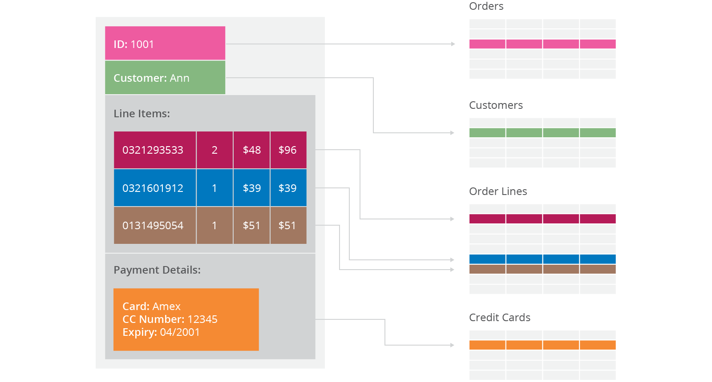
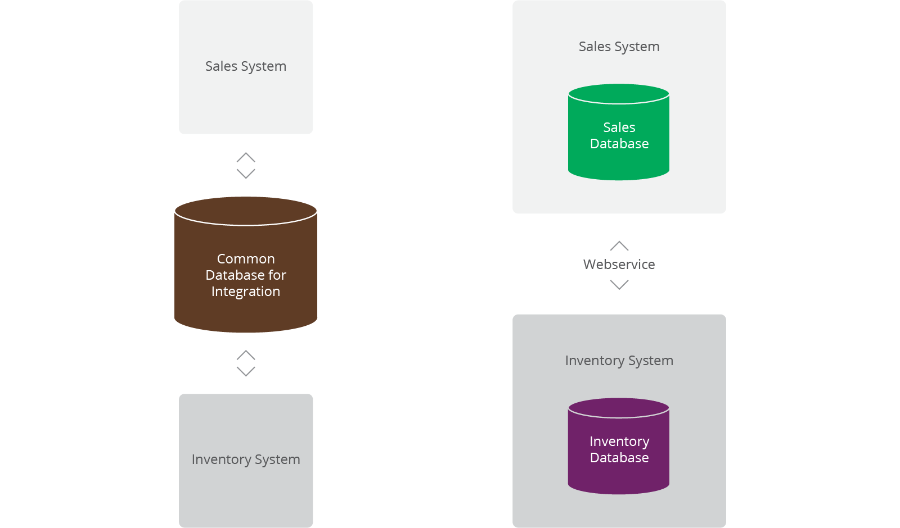
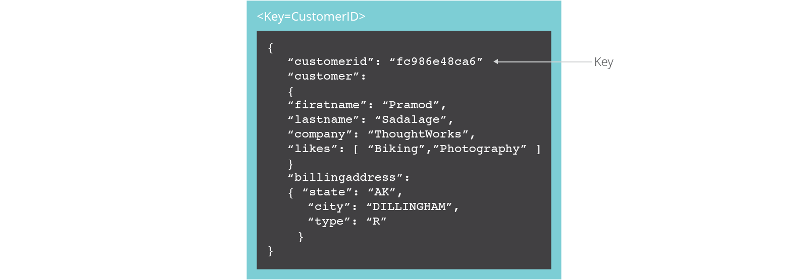
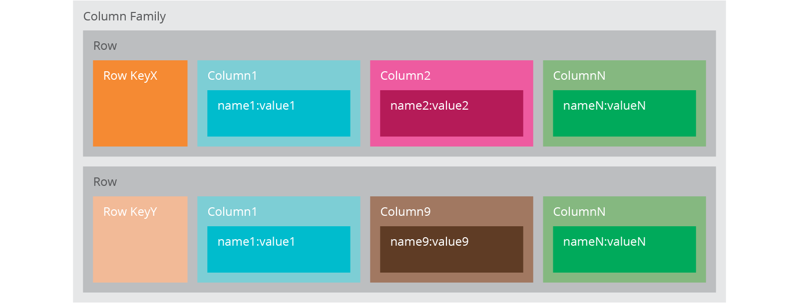
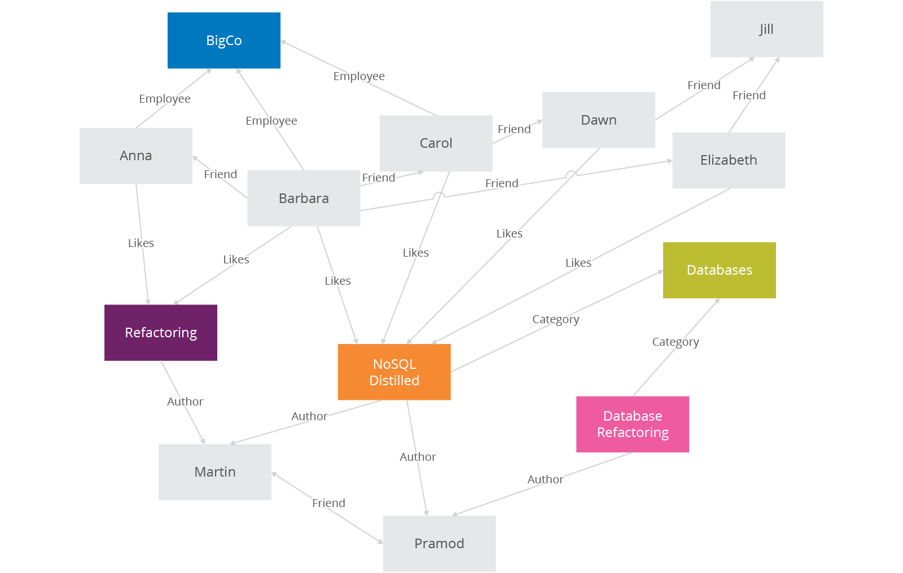
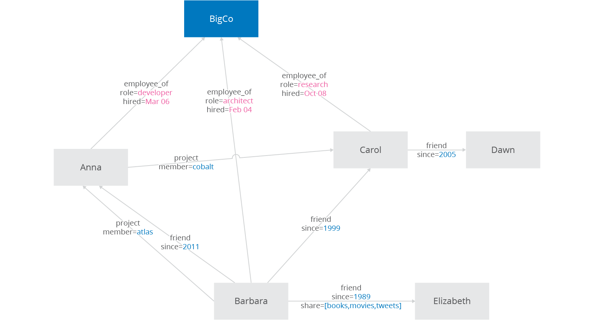

Over the last few years we have seen the rise of a new type of databases, known as NoSQL databases, that are challenging the dominance of relational databases. Relational databases have dominated the software industry for a long time providing mechanisms to store data persistently, concurrency control, transactions, mostly standard interfaces and mechanisms to integrate application data, reporting. The dominance of relational databases, however, is cracking.

Author: Martin Fowler https://www.thoughtworks.com/de/insights/blog/nosql-databases-overview

### **NoSQL what does it mean**

What does NoSQL mean and how do you categorize these databases? NoSQL means Not Only SQL, implying that when designing a software solution or product, there are more than one storage mechanism that could be used based on the needs. NoSQL was a hashtag (#nosql) choosen for a meetup to discuss these new databases. The most important result of the rise of NoSQL is Polyglot Persistence. NoSQL does not have a prescriptive definition but we can make a set of common observations, such as:

- Not using the relational model
- Running well on clusters
- Mostly open-source
- Built for the 21st century web estates
- Schema-less

### **Why NoSQL Databases**

Application developers have been frustrated with the impedance mismatch between the relational data structures and the in-memory data structures of the application. Using NoSQL databases allows developers to develop without having to convert in-memory structures to relational structures. 

There is also movement away from using databases as integration points in favor of encapsulating databases with applications and integrating using services. 

The rise of the web as a platform also created a vital factor change in data storage as the need to support large volumes of data by running on clusters. 

Relational databases were not designed to run efficiently on clusters.

The data storage needs of an ERP application are lot more different than the data storage needs of a Facebook or an Etsy, for example. 

### **Aggregate Data Models:**

Relational database modelling is vastly different than the types of data structures that application developers use. Using the data structures as modelled by the developers to solve different problem domains has given rise to movement away from relational modelling and towards aggregate models, most of this is driven by *Domain Driven Design*, a book by Eric Evans. An aggregate is a collection of data that we interact with as a unit. These units of data or aggregates form the boundaries for ACID operations with the database, Key-value, Document, and Column-family databases can all be seen as forms of aggregate-oriented database.

Aggregates make it easier for the database to manage data storage over clusters, since the unit of data now could reside on any machine and when retrieved from the database gets all the related data along with it. Aggregate-oriented databases work best when most data interaction is done with the same aggregate, for example when there is need to get an order and all its details, it better to store order as an aggregate object but dealing with these aggregates to get item details on all the orders is not elegant.

Aggregate-oriented databases make inter-aggregate relationships more difficult to handle than intra-aggregate relationships. Aggregate-ignorant databases are better when interactions use data organized in many different formations. Aggregate-oriented databases often compute materialized views to provide data organized differently from their primary aggregates. This is often done with map-reduce computations, such as a map-reduce job to get items sold per day.

### **Distribution Models:**

Aggregate oriented databases make distribution of data easier, since the distribution mechanism has to move the aggregate and not have to worry about related data, as all the related data is contained in the aggregate. There are two styles of distributing data:

- Sharding: Sharding distributes different data across multiple servers, so each server acts as the single source for a subset of data.
- Replication: Replication copies data across multiple servers, so each bit of data can be found in multiple places. Replication comes in two forms,
  - Master-slave replication makes one node the authoritative copy that handles writes while slaves synchronize with the master and may handle reads.
  - Peer-to-peer replication allows writes to any node; the nodes coordinate to synchronize their copies of the data.

Master-slave replication reduces the chance of update conflicts but peer-to-peer replication avoids loading all writes onto a single server creating a single point of failure. A system may use either or both techniques. Like Riak database shards the data and also replicates it based on the replication factor.

### **CAP theorem:**

In a distributed system, managing consistency(C), availability(A) and partition toleration(P) is important, Eric Brewer put forth the CAP theorem which states that in any distributed system we can choose only two of consistency, availability or partition tolerance. Many NoSQL databases try to provide options where the developer has choices where they can tune the database as per their needs. For example if you consider [Riak](http://basho.com/riak) a distributed key-value database. There are essentially three variables r, w, n where

- r=number of nodes that should respond to a read request before its considered successful.
- w=number of nodes that should respond to a write request before its considered successful.
- n=number of nodes where the data is replicated aka replication factor.

In a Riak cluster with 5 nodes, we can tweak the r,w,n values to make the system very consistent by setting r=5 and w=5 but now we have made the cluster susceptible to network partitions since any write will not be considered successful when any node is not responding. We can make the same cluster highly available for writes or reads by setting r=1 and w=1  but now consistency can be compromised since some nodes may not have the latest copy of the data. The CAP theorem states that if you get a network partition, you have to trade off availability of data versus consistency of data. Durability can also be traded off against latency, particularly if you want to survive failures with replicated data.

NoSQL databases provide developers lot of options to choose from and fine tune the system to their specific requirements.  Understanding the requirements of how the data is going to be consumed by the system, questions such as is it read heavy vs write heavy, is there a need to query data with random query parameters, will the system be able handle inconsistent data.

Understanding these requirements becomes much more important, for long we have been used to the default of  RDBMS which comes with a standard set of features no matter which product is chosen and there is no possibility of choosing some features over other. The availability of choice in NoSQL databases, is both good and bad at the same time. Good because now we have choice to design the system according to the requirements. Bad because now you have a choice and we have to make a good choice based on requirements and there is a chance where the same database product may be used properly or not used properly.

An example of feature provided by default in RDBMS is transactions, our development methods are so used to this feature that we have stopped thinking about what would happen when the database does not provide transactions. Most NoSQL databases do not provide transaction support by default, which means the developers have to think how to implement transactions, does every write have to have the safety of transactions or can the write be segregated into “critical that they succeed” and “its okay if I lose this write” categories. Sometimes deploying external transaction managers like [ZooKeeper](https://zookeeper.apache.org/) can also be a possibility.

### **Types of NoSQL Databases:**

NoSQL databases can broadly be categorized in four types.

**Key-Value databases**

Key-value stores are the simplest NoSQL data stores to use from an API perspective. The client can either get the value for the key, put a value for a key, or delete a key from the data store. The value is a blob that the data store just stores, without caring or knowing what's inside; it's the responsibility of the application to understand what was stored. Since key-value stores always use primary-key access, they generally have great performance and can be easily scaled.

Some of the popular key-value databases are [Riak](http://basho.com/riak/), [Redis](http://redis.io/) (often referred to as Data Structure server), [Memcached](http://memcached.org/) and its flavors, [Berkeley DB](http://www.oracle.com/technetwork/database/berkeleydb/index.html), [upscaledb ](http://upscaledb.com/)(especially suited for embedded use), Amazon DynamoDB (not open-source), Project Voldemort and [Couchbase](http://www.couchbase.com/).

All key-value databases are not the same, there are major differences between these products, for example: Memcached data is not persistent while in Riak it is, these features are important when implementing certain solutions. Lets consider we need to implement caching of user preferences, implementing them in memcached means when the node goes down all the data is lost and needs to be refreshed from source system, if we store the same data in Riak we may not need to worry about losing data but we must also consider how to update stale data. Its important to not only choose a key-value database based on your requirements, it's also important to choose which key-value database.

**Document databases**

Documents are the main concept in document databases. The database stores and retrieves documents, which can be XML, JSON, BSON, and so on. These documents are self-describing, hierarchical tree data structures which can consist of maps, collections, and scalar values. The documents stored are similar to each other but do not have to be exactly the same. Document databases store documents in the value part of the key-value store; think about document databases as key-value stores where the value is examinable. Document databases such as MongoDB provide a rich query language and constructs such as database, indexes etc allowing for easier transition from relational databases.

Some of the popular document databases we have seen are [MongoDB](https://www.mongodb.org/), [CouchDB](http://couchdb.apache.org/) , [Terrastore](https://code.google.com/p/terrastore/), [OrientDB](http://www.orientechnologies.com/orientdb/), [RavenDB](http://ravendb.net/), and of course the well-known and often reviled Lotus Notes that uses document storage.

**Column family stores**

Column-family databases store data in column families as rows that have many columns associated with a row key (Figure 10.1). Column families are groups of related data that is often accessed together. For a Customer, we would often access their Profile information at the same time, but not their Orders.

Each column family can be compared to a container of rows in an RDBMS table where the key identifies the row and the row consists of multiple columns. The difference is that various rows do not have to have the same columns, and columns can be added to any row at any time without having to add it to other rows.

When a column consists of a map of columns, then we have a super column. A super column consists of a name and a value which is a map of columns. Think of a super column as a container of columns.

[Cassandra](http://www.datastax.com/) is one of the popular column-family databases; there are others, such as [HBase](https://hbase.apache.org/), [Hypertable](http://hypertable.org/), and Amazon DynamoDB. Cassandra can be described as fast and easily scalable with write operations spread across the cluster. The cluster does not have a master node, so any read and write can be handled by any node in the cluster.

**Graph Databases**

Graph databases allow you to store entities and relationships between these entities. Entities are also known as nodes, which have properties. Think of a node as an instance of an object in the application. Relations are known as edges that can have properties. Edges have directional significance; nodes are organized by relationships which allow you to find interesting patterns between the nodes. The organization of the graph lets the data to be stored once and then interpreted in different ways based on relationships.

Usually, when we store a graph-like structure in RDBMS, it's for a single type of relationship ("who is my manager" is a common example). Adding another relationship to the mix usually means a lot of schema changes and data movement, which is not the case when we are using graph databases. Similarly, in relational databases we model the graph beforehand based on the Traversal we want; if the Traversal changes, the data will have to change.

In graph databases, traversing the joins or relationships is very fast. The relationship between nodes is not calculated at query time but is actually persisted as a relationship. Traversing persisted relationships is faster than calculating them for every query.

Nodes can have different types of relationships between them, allowing you to both represent relationships between the domain entities and to have secondary relationships for things like category, path, time-trees, quad-trees for spatial indexing, or linked lists for sorted access. Since there is no limit to the number and kind of relationships a node can have, they all can be represented in the same graph database.

Relationships are first-class citizens in graph databases; most of the value of graph databases is derived from the relationships. Relationships don't only have a type, a start node, and an end node, but can have properties of their own. Using these properties on the relationships, we can add intelligence to the relationship—for example, since when did they become friends, what is the distance between the nodes, or what aspects are shared between the nodes. These properties on the relationships can be used to query the graph.

Since most of the power from the graph databases comes from the relationships and their properties, a lot of thought and design work is needed to model the relationships in the domain that we are trying to work with. Adding new relationship types is easy; changing existing nodes and their relationships is similar to data migration, because these changes will have to be done on each node and each relationship in the existing data.

There are many graph databases available, such as [Neo4J](http://www.neo4j.org/), [Infinite Graph](http://www.objectivity.com/infinitegraph), [OrientDB](http://www.orientechnologies.com/orientdb/), or [FlockDB](https://github.com/twitter/flockdb) (which is a special case: a graph database that only supports single-depth relationships or adjacency lists, where you cannot traverse more than one level deep for relationships).

### **Why choose NoSQL database**

We've covered a lot of the general issues you need to be aware of to make decisions in the new world of NoSQL databases. It's now time to talk about why you would choose NoSQL databases for future development work. Here are some broad reasons to consider the use of NoSQL databases.

- To improve programmer productivity by using a database that better matches an application's needs.
- To improve data access performance via some combination of handling larger data volumes, reducing latency, and improving throughput.

It's essential to test your expectations about programmer productivity and/or performance before committing to using a NoSQL technology. Since most of the NoSQL databases are open source, testing them is a simple matter of downloading these products and setting up a test environment.

Even if NoSQL cannot be used as of now, designing the system using service encapsulation supports changing data storage technologies as needs and technology evolve. Separating parts of applications into services also allows you to introduce NoSQL into an existing application.

### **Choosing NoSQL database**

Given so much choice, how do we choose which NoSQL database? As described much depends on the system requirements, here are some general guidelines:

- Key-value databases are generally useful for storing session information, user profiles, preferences, shopping cart data. We would avoid using Key-value databases when we need to query by data, have relationships between the data being stored or we need to operate on multiple keys at the same time.
- Document databases are generally useful for content management systems, blogging platforms, web analytics, real-time analytics, ecommerce-applications. We would avoid using document databases for systems that need complex transactions spanning multiple operations or queries against varying aggregate structures.
- Column family databases are generally useful for content management systems, blogging platforms, maintaining counters, expiring usage, heavy write volume such as log aggregation. We would avoid using column family databases for systems that are in early development, changing query patterns.
- Graph databases are very well suited to problem spaces where we have connected data, such as social networks, spatial data, routing information for goods and money, recommendation engines

### **Schema-less ramifications**

All NoSQL databases claim to be schema-less, which means there is no schema enforced by the database themselves. Databases with strong schemas, such as relational databases, can be migrated by saving each schema change, plus its data migration, in a version-controlled sequence. Schema-less databases still need careful migration due to the implicit schema in any code that accesses the data.

Schema-less databases can use the same migration techniques as databases with strong schemas, in schema-less databases we can also read data in a way that's tolerant to changes in the data's implicit schema and use incremental migration to update data, thus allowing for zero downtime deployments, making them more popular with 24*7 systems.

### **Conclusion**

All the choice provided by the rise of NoSQL databases does not mean the demise of RDBMS databases. We are entering an era of polyglot persistence, a technique that uses different data storage technologies to handle varying data storage needs. Polyglot persistence can apply across an enterprise or within a single application. 

For more details, read[*NoSQL Distilled: A Brief Guide to the Emerging World of Polyglot Persistence*](http://martinfowler.com/books/nosql.html) by Pramod Sadalage and Martin Fowler. 